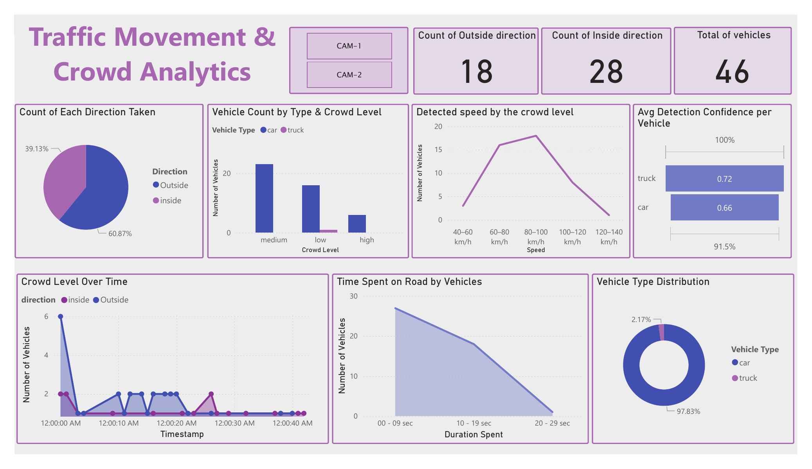

# Smart Traffic Monitoring System

A computer vision system that detects and tracks vehicles from road video footage, analyzing traffic direction, crowd levels, vehicle speed, and time spent on the road. Results are visualized in an interactive Power BI dashboard.

## Features

- Vehicle detection and tracking using YOLO and StrongSORT (via BoxMOT)
- Region-of-interest based counting for inside/outside direction analysis
- Crowd level classification (low / medium / high) based on vehicle counts
- Per-vehicle speed estimation
- Duration-on-road tracking per vehicle
- Data cleaning and export to SQLite and CSV
- Power BI dashboard for traffic and crowd analytics

## Demo



The dashboard includes:
- Total vehicle count, and count by direction (inside/outside)
- Vehicle count by type and crowd level
- Detected speed distribution by crowd level
- Average detection confidence per vehicle type
- Crowd level over time
- Time spent on road by vehicles

Sample output videos (with detection and tracking overlays):
- `results/result1.mp4` — CAM-1
- `results/result2.mp4` — CAM-2

## Tech Stack

| Component | Technology |
|---|---|
| Object Detection | YOLOv8 (Ultralytics) |
| Object Tracking | StrongSORT (BoxMOT) |
| Detection Utilities | Supervision |
| Data Processing | Pandas, NumPy |
| Storage | SQLite |
| Visualization | Power BI |

## Project Structure

```
smart-traffic-monitoring/
├── Dharhanroad1.ipynb      Main notebook: detection, tracking, and analysis pipeline
├── LICENSE
├── data/
│   ├── CleanedData1.csv    Cleaned vehicle event data — CAM-1
│   ├── CleanedData2.csv    Cleaned vehicle event data — CAM-2
│   └── DetectedCarsUpadated.db   SQLite database of detected vehicle events
├── dashboard/
│   ├── Dashboard.pbix      Power BI dashboard file
│   ├── Dashboard.pdf       Exported dashboard view
│   └── Dashboard.png       Dashboard preview image (used in this README)
├── results/
│   ├── result1.mp4         Detection and tracking output — CAM-1
│   └── result2.mp4         Detection and tracking output — CAM-2
└── README.md
```

## How It Works

1. Video frames are sampled from road footage and passed through a YOLOv8 model to detect vehicles (cars and trucks).
2. Detected vehicles are tracked across frames using StrongSORT, enabling direction, speed, and duration analysis within a defined region of interest.
3. Events (vehicle type, direction, speed, time spent, detection confidence) are logged to a SQLite database.
4. The raw data is cleaned, deduplicated, and rounded, then exported to CSV.
5. The cleaned data is visualized in a Power BI dashboard covering traffic direction, crowd levels, and vehicle behavior over time.

### Speed Estimation

Speed is estimated by measuring the time a tracked vehicle takes to cross between two reference lines drawn across the road, given a fixed, pre-calibrated real-world distance between them:

```
time_sec  = |frame_line2 − frame_line1| / fps
speed_kmph = (distance × 3.6) / time_sec
```

- `distance` — the real-world distance (in meters) between the two reference lines, calibrated manually for the camera view
- `frame_line1`, `frame_line2` — the frame numbers at which the tracked vehicle crosses each line
- `fps` — the video's frame rate
- `3.6` — converts meters per second to kilometers per hour

This is an approximation based on frame-to-frame line crossings rather than GPS or radar measurement, and its accuracy depends on how precisely the reference distance and lines are calibrated for a given camera angle.

## Setup

1. Clone the repository
   ```
   git clone https://github.com/<your-username>/smart-traffic-monitoring.git
   cd smart-traffic-monitoring
   ```

2. Open `Dharhanroad1.ipynb` in Google Colab or Jupyter. The notebook installs its own dependencies (`ultralytics`, `supervision`, `boxmot`) in the first cells.

3. Update the `video_path` variable in the notebook to point to your own input video.

4. Run all cells to reproduce detection, tracking, and the cleaned data outputs.

5. To view the dashboard, open `dashboard/Dashboard.pbix` in Power BI Desktop, or view `dashboard/Dashboard.pdf` for a static snapshot.

## Data Source

The input video used for this project is sourced from a publicly available YouTube video of Dhahran road traffic. This repository does not redistribute the original video; only derived outputs (detection data, tracking results, and dashboard visuals) are included.

## Limitations

- Detection and tracking accuracy depends on video quality, lighting, and camera angle, and may not generalize to all traffic conditions.
- Speed estimation depends on accurate manual calibration of the reference distance and line placement for each camera angle; it is an approximation, not a GPS- or radar-verified measurement.
- This is a prototype/demo project, not a certified traffic-monitoring tool.

## License

This project is licensed under the MIT License — see the LICENSE file for details.

## About

Built by Leena Bukair as part of an AI internship project applying computer vision to traffic monitoring and road safety analysis.
